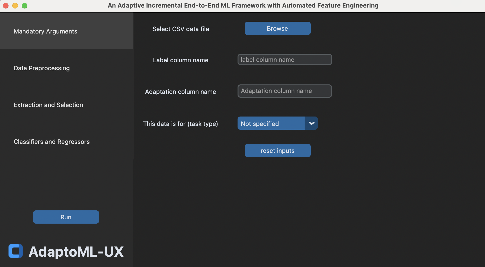
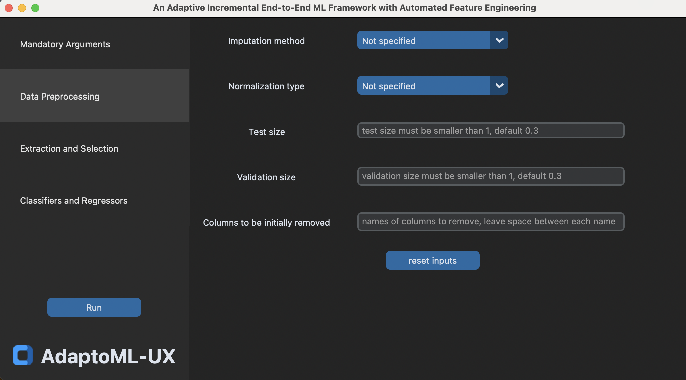
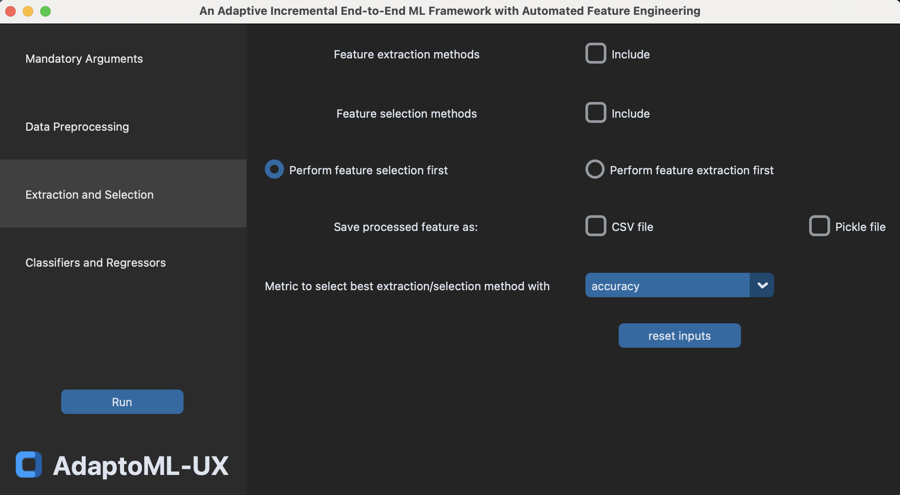
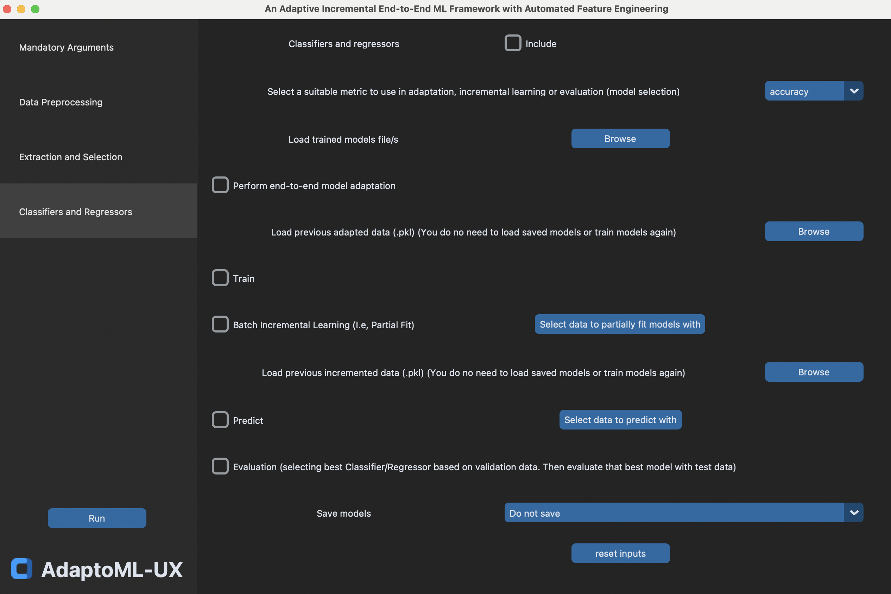

# AdaptoML_UX
An Adaptive Incremental End-to-End ML Framework with Automated Feature Engineering

## Project Overview
AdaptoML_UX is an innovative machine learning framework that offers an intuitive graphical user interface. It's designed to streamline and automate key stages in the machine learning workflow, such as feature extraction, selection, and model adaptation, making it more accessible for users with varying levels of expertise in machine learning.

## Installation Instructions
To get started with AdaptoML_UX, ensure you have Python 3.x installed on your system. Follow these steps:
1. Clone the repository or download the source code.
2. Navigate to the project directory and set up a virtual environment: `python -m venv venv`
3. Activate the virtual environment:
   - On Windows: `venv\Scripts\activate`
   - On Unix or MacOS: `source venv/bin/activate`
4. Install the required dependencies: `pip install -r requirements.txt`

## Usage Guide
Run `MainGUI.py` to start the application. The GUI is self-explanatory and user-friendly, guiding you through various steps of machine learning model development:

### Mandatory Arguments Section
![Mandatory Arguments]
- **Select CSV data file**: Click the 'Browse' button to upload your dataset in CSV format.
- **Label column name**: Enter the name of the column that contains the target or label for your model.
- **Adaptation column name**: If your data includes a column for adaptation (e.g., user ID), specify it here.
- **This data is for (task type)**: Choose the type of machine learning task from the dropdown menu (classification, regression, etc.).
- **Reset inputs**: Click this button to clear all inputs and reset to default settings.

### Data Preprocessing Section

- **Imputation method**: Choose how you want to handle missing data from the dropdown menu.
- **Normalization type**: Select the normalization technique for your data.
- **Test size**: Specify what proportion of your data should be used for testing.
- **Validation size**: Define the size of the validation set.
- **Columns to be initially removed**: List any columns you want to exclude from the model.

### Extraction and Selection Section

- **Feature extraction methods**: Check the methods you want to apply for feature extraction.
- **Feature selection methods**: Choose the methods for feature selection.
- **Perform feature selection first**: Toggle whether to perform feature selection before extraction.
- **Save processed feature as**: Decide if you want to save processed features as a `.csv` or `.pkl` file.
- **Metric to select best extraction/selection method with**: Select the metric for evaluating feature extraction and selection from the dropdown.

### Classifiers and Regressors Section

- **Classifiers and regressors**: Enable or disable this module using the checkbox.
- **Select a suitable metric**: From the dropdown, choose the metric for adaptation, incremental learning, or evaluation.
- **Load trained models file/s**: Use the 'Browse' button to upload pre-trained model files.
- **Perform end-to-end model adaptation**: Check this option to adapt your model throughout the entire process.
- **Load previous adapted data (.pkl)**: Upload previously adapted data if available.
- **Train**: Tick this checkbox to train a new model.
- **Batch Incremental Learning (i.e., Partial Fit)**: Select data for batch incremental learning.
- **Predict**: Enable the prediction feature.
- **Evaluation**: Provides information on the model evaluation process.
- **Save models**: Decide whether to save the trained models using the dropdown.

These features are part of the AdaptoML-UX interface, designed to facilitate an interactive and user-friendly experience for machine learning model development.

## Code Structure
- `MainGUI.py`: Core file for the application's graphical interface.
- `ComputeOutput.py`: Manages the computation and processing of models.
- `Classifiers_Regressors.py`: Implements various machine learning models.
- Other files like `FeatureExtraction.py`, `FeatureSelection.py`, and `Imputation.py` handle respective functionalities in the ML pipeline.
- `Utilities.py`: Provides supporting functions used throughout the application.

## Issues

If you face any problems while using the toolkit, please open an issue here - https://github.com/MichaelSargious/AdaptoML_UX/issues or contact us under amgo02@dfki.de.

## License Information
[Specify License Here]

## Contact Information
For support, queries, or contributions, please reach out to amgo02@dfki.de.
